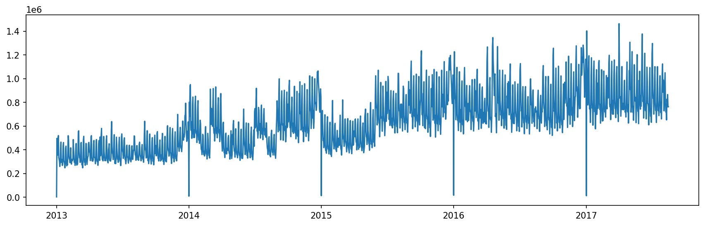

# Exploratory Data Analysis (EDA)

**Objective**

The goal of this stage is to explore the dataset to uncover meaningful patterns, relationships, and potential drivers of sales behavior.

Building on the previous data quality assessment, this phase focuses on understanding:

- How sales vary over time
- Differences across product categories
- Store-level variations
- The impact of promotions on sales

The insights derived from this stage will guide feature engineering and modeling decisions.

**Scope**

This analysis focuses on:

- Temporal patterns (daily, weekly, seasonal effects)
- Category-level behavior (`family`)
- Store-level differences (`store_nbr`)
- Promotion effects (`onpromotion`)

The objective is not to build models yet, but to identify structure and signals within the data.

**Analytical Approach**

The EDA will be conducted through:

- Aggregation and grouping analysis
- Time-series visualization
- Distribution analysis
- Comparative analysis across key dimensions

Special attention will be given to identifying:

- Stable patterns vs irregular fluctuations
- Systematic differences across groups
- Potential interactions between features

**Link to Previous Stage**

The dataset has been validated as clean and usable during the data quality assessment stage.

Therefore, no additional preprocessing is performed here, and the analysis is conducted directly on the original dataset.

**Key Hypotheses**

Based on prior structural understanding, we aim to validate the following:

- Sales exhibit strong weekly patterns
- Product categories have distinct consumption structures
- Stores differ mainly in scale rather than composition
- Promotions have heterogeneous effects across categories

These hypotheses will be tested and refined throughout the analysis.

## 1.Time Dimension Analysis

### 1.1Aggregate Sales Trend Over Time

To obtain an initial view of the temporal structure, sales are aggregated across all stores and product categories and analyzed over time.

This step is intended to identify whether the time dimension exhibits broad trend or cyclical behavior before moving to finer-grained temporal breakdowns.

