# Exploratory Data Analysis (EDA)

**Objective**

The goal of this stage is to explore the dataset to uncover meaningful patterns, relationships, and potential drivers of sales behavior.

Building on the previous data quality assessment, this phase focuses on understanding:

- How sales vary over time
- Differences across product categories
- Store-level variations
- The impact of promotions on sales

The insights derived from this stage will guide feature engineering and modeling decisions.

**Scope**

This analysis focuses on:

- Temporal patterns (daily, weekly, seasonal effects)
- Category-level behavior (`family`)
- Store-level differences (`store_nbr`)
- Promotion effects (`onpromotion`)

The objective is not to build models yet, but to identify structure and signals within the data.

**Analytical Approach**

The EDA will be conducted through:

- Aggregation and grouping analysis
- Time-series visualization
- Distribution analysis
- Comparative analysis across key dimensions

Special attention will be given to identifying:

- Stable patterns vs irregular fluctuations
- Systematic differences across groups
- Potential interactions between features

**Link to Previous Stage**

The dataset has been validated as clean and usable during the data quality assessment stage.

Therefore, no additional preprocessing is performed here, and the analysis is conducted directly on the original dataset.

**Key Hypotheses**

Based on prior structural understanding, we aim to validate the following:

- Sales exhibit strong weekly patterns
- Product categories have distinct consumption structures
- Stores differ mainly in scale rather than composition
- Promotions have heterogeneous effects across categories

These hypotheses will be tested and refined throughout the analysis.

## 1.Time Dimension Analysis

### 1.1Aggregate Sales Trend Over Time

To obtain an initial view of the temporal structure, sales are aggregated across all stores and product categories and analyzed over time.

This step is intended to identify whether the time dimension exhibits broad trend or cyclical behavior before moving to finer-grained temporal breakdowns.

*Figure: Aggregated daily sales over time, illustrating both long-term trend and cyclical variation. The increasing variance with higher sales levels suggests heteroscedastic behavior. The temporal structure indicates that time is a key driver of sales dynamics and should be explicitly modeled.*

#### Initial Observation

The aggregated sales series suggests that time is a major structural dimension in this dataset.

At the overall level, sales exhibit both a noticeable long-term trend and recurring cyclical fluctuations, indicating that further temporal decomposition is necessary in subsequent analysis.

#### Temporal Aggregation: From Daily to Monthly

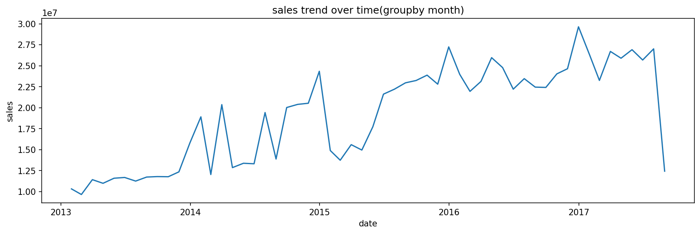

*Figure： Monthly aggregated sales over time. The series smooths out high-frequency noise and reveals a clear upward trend, along with recurring seasonal fluctuations across years. The sharp drop at the end is likely due to incomplete data rather than an actual decline in sales.*

### Summary of trend over time

Based on aggregated sales across all stores and product categories in the training set, several structural observations can be made. These findings are intended to guide subsequent analysis and modeling rather than serve as final conclusions.

#### Long-term Trend
From 2013 to 2017, total sales show a clear upward trend. This suggests that the time dimension is a major source of structure in the dataset, with the baseline sales level increasing over time. As a result, the series does not satisfy a simple stationarity assumption.

#### Seasonal Pattern
The monthly aggregated series shows recurring annual fluctuations. Peaks and troughs tend to appear in similar periods across different years, indicating the presence of meaningful yearly seasonality in sales behavior.

#### Volatility Pattern
Sales variability changes over time. Earlier periods exhibit relatively sharper fluctuations, while later periods fluctuate around a higher baseline level. This suggests potential heteroscedasticity in the sales series.

#### Boundary Note
The sharp decline at the end of the time series is inconsistent with the overall structure and is more likely caused by incomplete time coverage rather than a genuine business shock. This boundary effect should be treated with caution in later analysis and modeling.

#### Conclusion
Overall, the time dimension appears to be a strong structural factor in total sales, combining both long-term trend and stable seasonal patterns. Time-related features should therefore be retained in subsequent modeling, and further decomposition with other dimensions such as product category, store, and promotion is necessary.

### 2. Monthly Aggregation

To explore details of sales change with dates, it's necessary to alter the range of date.This step is intended to find patterns between month and sales.

#### 2.1 Absolute Monthly Sales Comparison

To compare monthly sales patterns across years, total sales are aggregated by month within each year.

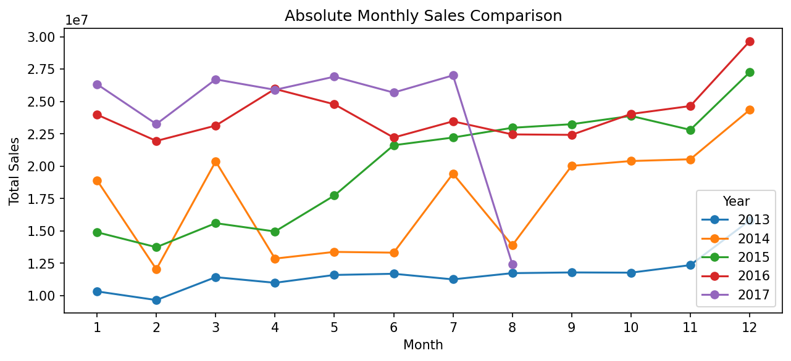

*Figure：Absolute monthly sales by year. The plot compares total sales levels across months for each year, highlighting differences in overall scale while preserving the general shape of intra-year patterns.*

**Observation**

The comparison reveals significant differences in overall sales scale across years, reflecting the strong upward trend identified earlier. This scale difference dominates the visualization.

Although the general shape of monthly curves appears similar across years, the absolute values make it difficult to directly compare the relative importance of each month within a given year.

Therefore, absolute monthly comparisons are more suitable for observing growth patterns over time, but not ideal for analyzing intra-year sales structure.

#### 2.2 Monthly Sales Share (Within-Year Normalization)

To better compare intra-year structure, monthly sales are normalized by total annual sales for each year.

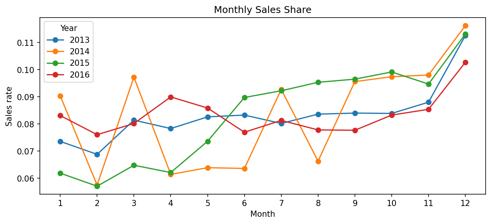

*Figure：Monthly sales share within each year after normalization by total annual sales. This representation removes scale differences and emphasizes the relative contribution of each month to annual sales.*

**Observation**

After excluding the incomplete year (2017), the normalized monthly sales patterns show strong consistency across years.

Most years exhibit a similar distribution:
- Early months (especially February) tend to have relatively lower contributions
- Late months (November–December) account for a higher proportion of annual sales

This indicates that month acts as a stable relative-position feature within a year, rather than being driven by random fluctuations in any single year.

#### Monthly Summary

The monthly analysis reveals two key structural properties:

1. Absolute sales are dominated by long-term growth, making cross-year comparisons difficult without normalization.
2. After normalization, a stable intra-year pattern emerges, suggesting that month captures consistent seasonal structure.

This implies that:
- Time-related features should be modeled at both absolute (trend) and relative (seasonality) levels
- Month is a strong candidate feature for capturing recurring seasonal effects in sales

### 3.Weekly Pattern (Day-of-Week Effect)
To examine intra-week seasonality, sales are aggregated by day of the week and normalized by total weekly sales to obtain relative sales contribution (sales_rate) for each day.

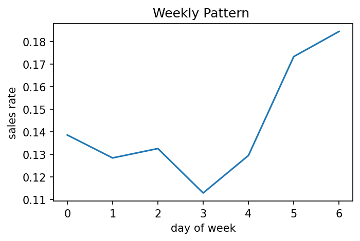

*Figure：Average sales share by day of the week after normalization. The plot illustrates the relative contribution of each weekday to total weekly sales, highlighting intra-week variation.*

**Observation**

A clear intra-week pattern is observed:

- Sales are significantly higher on weekends (day 5–6)
  - Saturday accounts for approximately 17.3%
  - Sunday accounts for approximately 18.4%
- Wednesday (day 3) shows the lowest sales contribution at around 11.3%
- Monday to Thursday remain relatively stable, with sales contributions ranging between 12% and 14%

**Interpretation**
The sales distribution exhibits a strong "weekend peak" pattern.

This aligns with typical retail behavior, where customers tend to concentrate their purchases during weekends, leading to higher aggregated sales.

**Implication for Modeling**

This result suggests that weekday is an important temporal feature influencing sales.

Therefore, in subsequent analysis (e.g., when evaluating the effect of promotion), it is necessary to control for weekly seasonality to avoid mistakenly attributing regular temporal fluctuations to other factors.

### 4. Holiday Effect on Sales

To evaluate the impact of holidays on sales, a binary indicator (`is_holiday`) is constructed based on the holiday calendar.

Daily total sales are then compared between holiday and non-holiday observations to assess whether holidays introduce significant shifts in sales behavior.

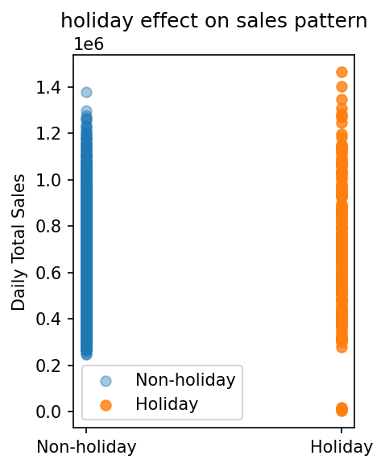

*Figure：Distribution of daily total sales for holiday and non-holiday periods. The plot compares sales levels across the two groups to assess potential differences in sales behavior.*

**Observation**

The distribution of daily total sales for holiday and non-holiday periods shows a high degree of overlap.

No clear separation between the two groups is observed at the aggregate level, indicating that holidays do not consistently lead to higher or lower sales across the dataset.

**Interpretation**

This suggests that the effect of holidays is not a dominant global driver of sales variation.

Instead, holiday impact is likely conditional on other factors such as:

- Product category (family)
- Store characteristics
- Promotion intensity

In other words, holidays may act as a contextual modifier rather than a primary scaling factor.

**Implication for Modeling**

Given the weak aggregate signal, the holiday variable alone is unlikely to significantly improve model performance.

However, it may still provide value when combined with other features (e.g., interaction terms with product family or promotion).

Therefore, holiday should be treated as a secondary feature rather than a primary driver.

A more detailed analysis (e.g., distribution plots or conditional breakdowns) may further reveal localized effects.

## Family Dimension Analysis

### 1.Family-Level Weekly Consumption Structure

#### Methodology

Instead of analyzing absolute sales volume, this section focuses on the relative share of each product family in daily total sales.

To construct a stable representation of weekly consumption patterns, the following approach is used:

- Each day is treated as an independent observation of consumption structure
- For each day, the share of each product family is calculated relative to total daily sales
- These daily shares are then averaged across the same day of the week (Day of Week)

This approach ensures that:

- High-volume days (e.g., promotions or holidays) do not dominate the structure
- The analysis reflects typical consumption allocation patterns rather than scale effects

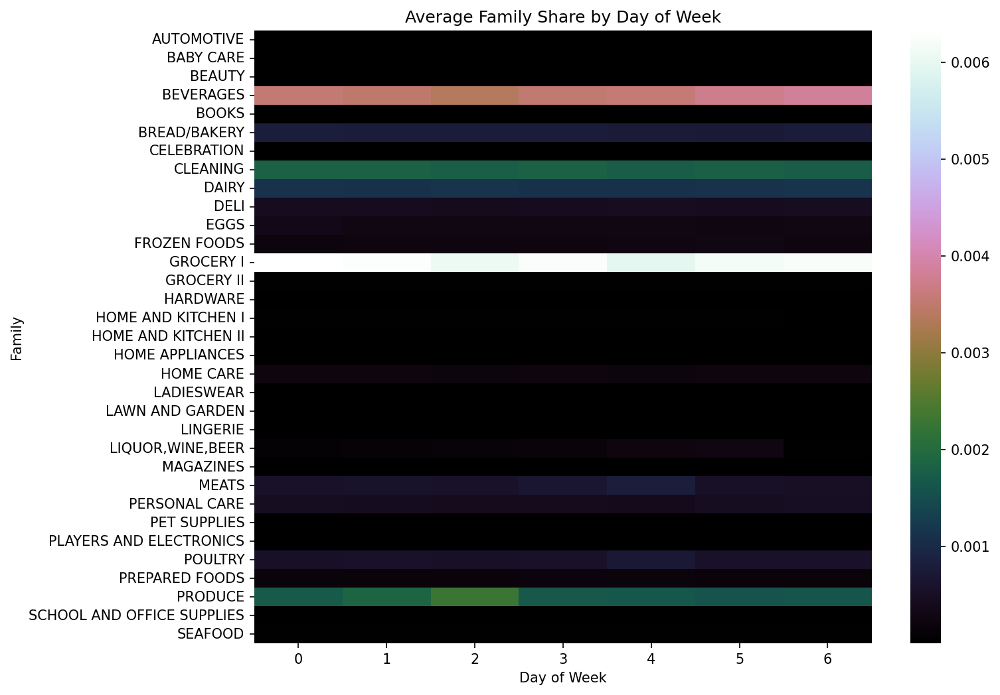

*Figure：Average sales share of product families across days of the week. The heatmap shows the relative contribution of each category within a week, highlighting consistency or variation in consumption structure over time.*

**Observation**

Across product families, the weekly consumption structure is highly consistent.

Core categories such as GROCERY I, BEVERAGES, CLEANING, and PRODUCE maintain relatively high shares across all days of the week, forming the backbone of daily consumption.

For most categories, the variation in share across weekdays is limited, indicating strong structural stability.

Some categories exhibit mild but interpretable intra-week variations:

- MEATS and POULTRY show slightly higher shares toward the end of the week, possibly linked to weekend meal preparation or gatherings
- BEVERAGES tend to increase on weekends, consistent with leisure and social consumption patterns
- PRODUCE shows a slight mid-week increase (e.g., Wednesday), though no definitive explanation is identified at this stage

**Interpretation**

Overall, the weekly structure at the product family level is relatively stable, with weekday effects acting as a secondary factor rather than a dominant driver of variation.

**Implication for Modeling**

This suggests that:

- Product family represents a strong structural dimension in consumption behavior
- Weekday effects may be relevant for fine-grained adjustments, but are unlikely to fundamentally alter the overall consumption structure

Therefore, in subsequent modeling, family can be treated as a primary structural feature, while weekday can be incorporated as a secondary temporal adjustment factor.

### 2.Family Structure under Holiday Conditions

In this section, the focus is not on whether holidays increase total sales, but on whether they alter the relative structure of consumption across product families.

To avoid confounding structural changes with scale effects, we continue to use the share of each product family in daily total sales (`family_share`) as the primary unit of analysis.

#### Methodology

For simplicity and robustness at the EDA stage, holidays are treated as a binary variable:

- `is_holiday = True`: the date is marked as a holiday
- `is_holiday = False`: the date is not a holiday

No further distinction is made between different holiday types (e.g., national, local, transferred holidays), to avoid introducing unnecessary complexity at this stage.

The analysis proceeds as follows:

1. Split the data into holiday and non-holiday groups
2. Compute the average `family_share` within each group
3. Compare the distribution of shares across product families

This allows us to directly assess:

- Whether holidays induce systematic structural shifts
- Which product categories deviate from their normal consumption patterns

**Note**

 This section focuses on structural changes (structure shift), rather than changes in overall sales volume.

- If a product family maintains a similar share during holidays, the holiday effect can be interpreted as a scaling effect
- If the share shifts significantly, it may indicate a behavioral regime change

The goal here is to identify such structural differences, rather than to explicitly model the holiday effect.

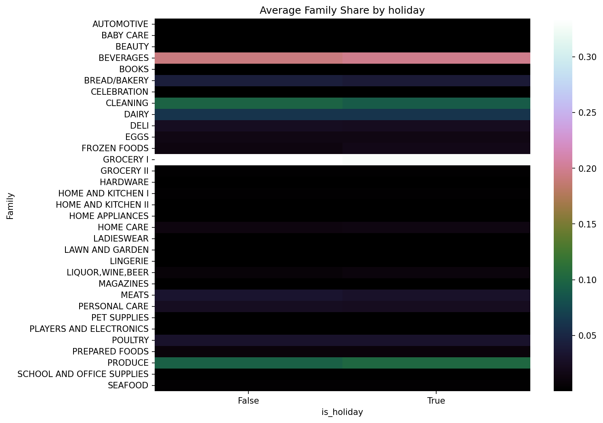

*Figure: Average sales share of product families for holiday and non-holiday periods. The heatmap compares category-level composition between the two conditions to assess potential shifts in consumption structure.*

**Observation**

The relative share of product families remains highly consistent between holiday and non-holiday periods.

No significant structural shifts are observed across most categories.

The overall consumption structure appears stable, with only minor variations in a few categories.

**Product Structure Stability**

A small number of core categories dominate the consumption structure:

- GROCERY I consistently accounts for the largest share
- PRODUCE, BEVERAGES, and CLEANING form a stable second tier
- Most other categories contribute relatively small and stable proportions

This hierarchy remains largely unchanged across conditions.

**Impact of Holidays on Consumption Structure**

Comparing holiday and non-holiday conditions:

- The relative composition of product categories remains highly consistent
- No systematic amplification or suppression of specific categories is observed
- Holidays do not fundamentally alter the structure of consumption

This suggests that holidays do not trigger a structural regime change, but rather operate within an already stable consumption pattern.

**Impact on Sales Scale**

Consistent with earlier findings:

- The distribution of total sales remains similar between holiday and non-holiday periods
- No clear evidence of strong uplift or distributional shift is observed

Thus, the effect of holidays on overall sales scale appears limited.

### EDA Summary and Next Steps

From the analyses above, we conclude:

- Product family defines the core structure of consumption
- Store differences mainly affect scale rather than structure
- Holiday effects are weak and conditional

Based on these findings, the next stage of analysis will focus on:

- Promotion: its impact on both sales scale and structure
- Store: differences in scale, stability, and variability

This framework helps distinguish between structural variables and scale-related variables, providing a clearer foundation for feature design and model development.

## Promotion dimension Analysis

### 1.Onpromotion: Distribution Overview

To understand the fundamental properties of the `onpromotion` variable, we first examine its statistical distribution and frequency patterns.

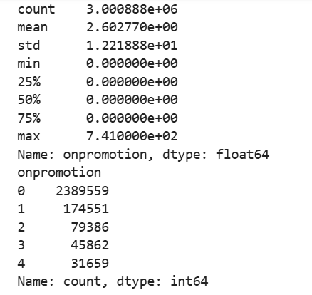

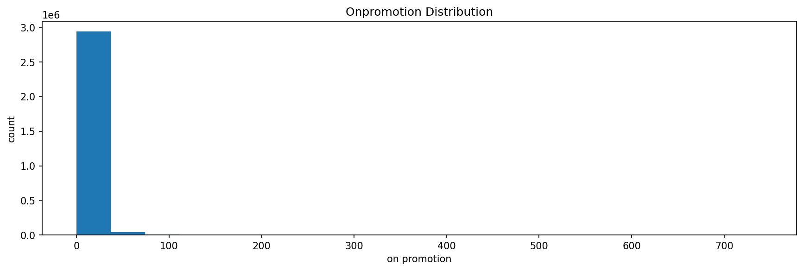

*Figure: Distribution of promotion intensity (onpromotion) across the dataset. The histogram illustrates the frequency of different promotion levels, highlighting the overall distribution and potential skewness.*

#### Descriptive Statistics

Key observations from the summary statistics:

- The dataset contains approximately **3 million records**
- The mean of `onpromotion` is **2.6**, while the standard deviation is **12.2**, indicating a highly dispersed distribution
- The median is **0**, and even the 75th percentile remains **0**
- The maximum value reaches **741**, far exceeding typical levels

These results suggest that:

- In most cases, no promotion is applied
- Occasionally, a large number of items are promoted simultaneously

#### Frequency Distribution

From the value counts:

- `onpromotion = 0` dominates the dataset (≈ 2.38 million records)
- When promotions occur, they are typically small in scale (e.g., 1–4 items)
- High promotion counts exist but are extremely rare

The histogram further confirms that:

- The distribution is **highly right-skewed**
- It exhibits a **zero-inflated + long-tail** pattern
- A small number of extreme values stretch the right tail

#### Preliminary Interpretation

From the above observations:

- Most store–family–date combinations do not involve promotions
- Promotions represent a **sparse but strong intervention mechanism**
- When promotions occur, they may involve multiple products simultaneously

Therefore, `onpromotion` should be treated as:

> a highly imbalanced intervention variable, rather than a regular continuous feature

Further analysis will focus on:

- Whether promotion intensity affects overall sales scale
- Whether promotion introduces systematic deviations from baseline sales
- Whether promotion alters the consumption structure across product families

### 2.Promotion Intensity vs Normalized Sales

#### **Methodology**

To better isolate the effect of promotions, we normalize daily sales using a short-term baseline.

Specifically:

- A **7-day rolling mean (shifted)** is used as the baseline
- This represents the expected sales level without abnormal fluctuations

The normalized sales is defined as:

normalized_sales = sales / baseline

This transformation helps:

- Remove short-term temporal fluctuations (e.g., weekly patterns)
- Control for slow-moving trends
- Focus on deviations driven by promotion activity

To analyze promotion intensity:

- `onpromotion` is used as a proxy for promotion strength

- The variable is discretized using **quantile-based binning (qcut)**

- This ensures comparable sample sizes across different intensity levels

  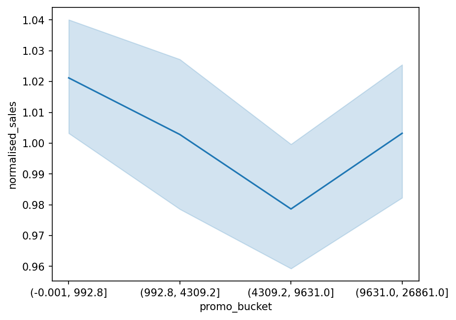

*Figure: Relationship between promotion intensity and normalized sales, using quantile-based bins to ensure comparable sample sizes across groups. The plot shows how sales vary across different levels of promotion intensity.*

#### Observations

From the relationship between promotion intensity and normalized sales:

- When promotion intensity is low, normalized sales tend to be slightly above baseline  
- As promotion intensity increases to moderate levels, sales slightly decline relative to baseline  
- At higher intensities, sales recover but remain close to baseline overall  

Overall:

> After controlling for temporal effects, the relationship between promotion intensity 
> and total sales is relatively weak.

#### Interpretation

One possible explanation is that promotions are **not randomly assigned**:

- Retailers may increase promotions during periods of lower expected demand  
- As a result, the observed effect is partially offset at the aggregate level  

Additionally:

- `onpromotion` measures the **number of promoted items**,  
  but does not capture discount magnitude or promotion type  

Therefore:

- Its explanatory power for total sales is inherently limited

#### Key Insight

Promotion effects appear to be:

- Potentially meaningful at the **product or category level**  
- But relatively weak at the **aggregate daily sales level**

This suggests that:

> Promotion is more likely to influence **local demand behavior**,  
> rather than globally shifting total sales.

In subsequent modeling, promotion features should be carefully designed to capture local or interaction effects, rather than relying on raw aggregation at the global level.

### 3.Promotion × Family: Heterogeneous Effects

In this section, we focus not on the overall impact of promotion on total sales, but on whether **promotion affects different product families differently**.

The goal is to identify **heterogeneity in promotion effectiveness across categories**.

### Methodology

We define promotion status as a binary variable:

- `is_promotion = True` if `onpromotion > 0`
- `is_promotion = False` if `onpromotion = 0`

For each product family, we compute:

- Average sales under promotion
- Average sales without promotion

Then define:

**promotion effect ratio = (mean sales with promotion) / (mean sales without promotion)**

Interpretation:

- **> 1**: promotion increases sales
- **≈ 1**: little or no effect
- **< 1**: promotion may coincide with low-demand periods

A reference line at **ratio = 1** is used as a baseline.

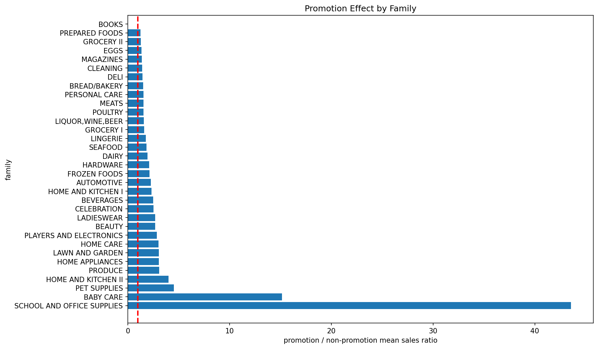

*Figure: Promotion effect across product families, measured as the ratio of average sales during promotion versus non-promotion periods. The chart compares how different categories respond to promotional activity.*

#### Observation

The promotion effect varies significantly across product families.

**Highly promotion-sensitive categories include:**

- SCHOOL AND OFFICE SUPPLIES
- BABY CARE
- PET SUPPLIES

These categories show substantial increases in average sales during promotion periods.

------

**Less sensitive categories (mainly food-related):**

- DAIRY
- MEATS
- BREAD/BAKERY
- GROCERY

For these categories, promotion leads to relatively limited uplift.

------

### Interpretation

This heterogeneity aligns with typical consumer behavior patterns:

**1. Stockable goods (promotion-sensitive)**
(e.g., stationery, baby products, pet supplies)

- Higher unit price
- Longer shelf life
- Lower purchase frequency

→ Consumers tend to **stock up during promotions**

------

**2. Perishable / high-frequency goods (less sensitive)**
(e.g., milk, fresh food, bread)

- Short shelf life
- Frequent consumption

→ Purchase quantity is constrained, limiting promotion impact

------

### Why the overall promotion effect appears weak

This explains why earlier analysis showed:

> weak relationship between total sales and promotion

Key reasons:

- Promotion-sensitive categories account for a **small share of total sales**
- Core categories (e.g., grocery, food) are **less responsive to promotion**
- Aggregation across families **dilutes heterogeneous effects**

Additionally:

- Promotions are **not randomly assigned**
- They may occur during **low-demand periods**

→ This introduces **selection bias**, further weakening observed effects

------

### Summary

Promotion exhibits strong **category-level heterogeneity**:

- Stockable, non-essential goods are highly responsive
- Essential, perishable goods are less affected

This suggests:

> The interaction between `promotion` and `family` is important

Rather than treating promotion as a uniform driver,
it should be modeled as a **conditional effect depending on product category**.

## Store Dimension Analysis

After analyzing temporal patterns, product categories, and promotion effects, we further investigate how sales vary across different stores from a spatial perspective.

#### Methodology

We analyze store-level effects from two complementary perspectives:

1. **Total Sales by Store (Scale Analysis)**

   - Aggregate total sales by `store_nbr`
   - Compare overall sales volume across stores using a bar chart

2. **Daily Sales Distribution by Store (Stability Analysis)**

   - Aggregate daily sales by (`date`, `store_nbr`)
   - Use boxplots to examine distributional differences across stores
   - Focus on median levels, variability, and outliers

   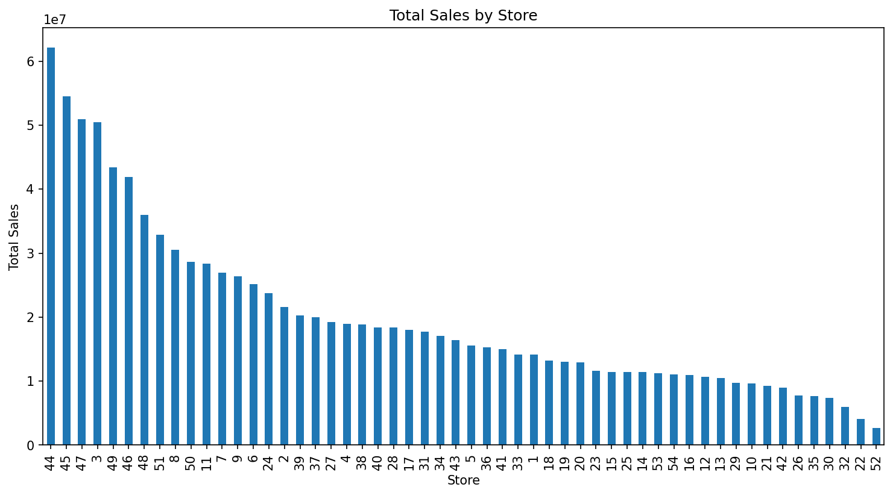

   *Figure: Total sales aggregated by store, ranked in descending order. The chart illustrates differences in overall sales scale across stores.*

   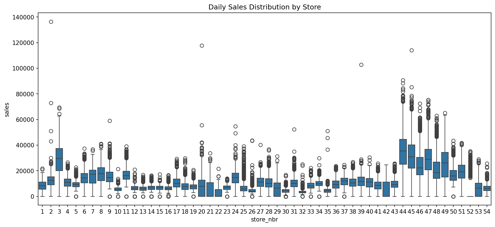

*Figure: Distribution of daily sales by store. The boxplot summarizes median levels, variability, and outliers for each store.*

#### Observations

1. **Significant variation in total sales across stores**
   - Large differences in total sales volume between stores
   - Presence of clear high-performing stores (head)
   - Long-tail distribution with many lower-performing stores
2. **Each store exhibits a distinct sales baseline**
   - Median daily sales differ substantially across stores
   - Some stores consistently operate at higher sales levels
   - These differences remain stable over time
3. **Heterogeneous variability patterns across stores**
   - Some stores show tight distributions → stable demand
   - Others exhibit high variance → volatile demand
   - Certain stores contain frequent extreme outliers (spikes)

------

#### Interpretation

From a structural perspective, the `store` variable primarily captures:

- Customer traffic (footfall)
- Location-related factors
- Store scale and capacity

Therefore, **store fundamentally determines the baseline (scale) of sales**, rather than:

- Product composition (`family`)
- Temporal patterns (seasonality)
- Promotion-driven fluctuations

In other words:

> Store defines the *level* of sales, not the *shape* of fluctuations.

------

#### Relationship with Previous Findings

Combining with earlier analysis:

- `family` → determines *what* is sold
- `time` (day-of-week / seasonality) → determines *when* sales increase
- `promotion` → introduces *short-term deviations*
- `store` → determines *overall scale (baseline)*

These dimensions together form a structured decomposition of sales behavior.

------

#### Modeling Implications

- `store_nbr` is a **critical feature** and must be included in the model
- Possible encoding strategies:
  - Categorical encoding (recommended baseline approach)
  - One-hot encoding
  - Store embeddings (advanced)

More importantly:

> The model must explicitly capture **baseline differences across stores**

Otherwise, the model may incorrectly attribute store-level differences to other features (e.g., promotions or temporal effects).

------

#### Summary

- Store has a strong impact on sales, primarily through scale differences
- Each store operates on a relatively stable baseline level
- Variability patterns differ across stores, indicating heterogeneous demand dynamics

> Store determines the **“ground level” of sales**, not the fluctuation patterns.

## Transactions as a Driver of Sales (Transactions × Sales)

Building on previous analyses of time, product categories, promotions, and store effects, we introduce `transactions` as a proxy for customer traffic to further understand the underlying drivers of sales.

### Methodology

We analyze the role of transactions from three perspectives:

1. **Transactions vs. Sales (Core Relationship)**
   - Aggregate daily sales and transaction counts by (`date`, `store_nbr`)
   - Use scatter plots to examine their relationship
2. **Temporal Patterns of Transactions**
   - Extract day-of-week (`dow`) from `date`
   - Compute average transactions by `dow`
   - Analyze weekly patterns using line plots
3. **Transactions vs. Promotion**
   - Aggregate promotion intensity (`onpromotion`) and transactions
   - Examine their relationship using scatter plots

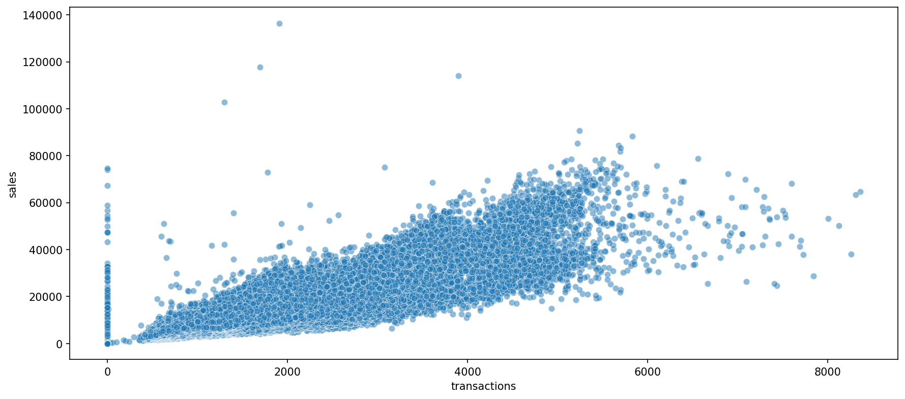

*Figure: Relationship between number of transactions and total sales. The scatter plot illustrates how sales vary with transaction volume across observations.*

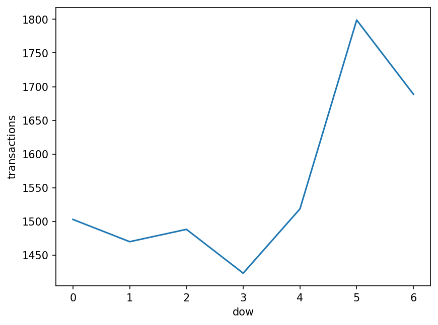

*Figure: Average number of transactions by day of the week. The plot shows how transaction volume varies across weekdays, reflecting intra-week temporal patterns.*

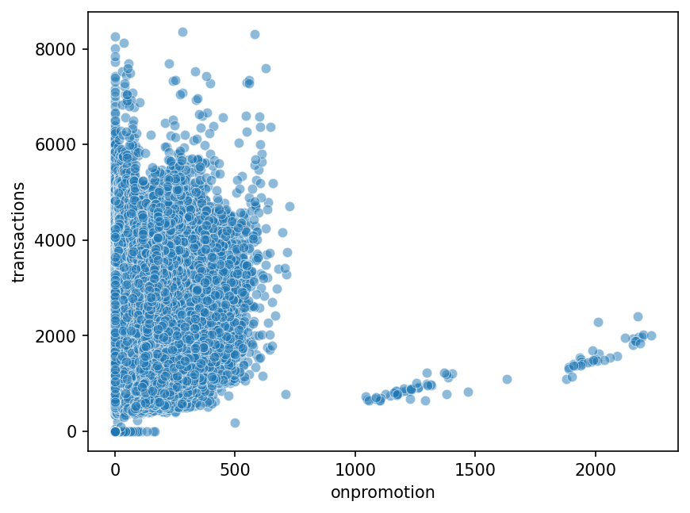

*Figure: Relationship between promotion intensity and transaction volume. The scatter plot compares how the number of transactions varies with different levels of promotion.*

### Observations

1. **Transactions and sales show a strong positive correlation**  
   - Higher transaction counts generally correspond to higher sales  
   - However, the relationship exhibits a clear **fan-shaped dispersion**  
   - Variance in sales increases with transaction volume  

2. **Transactions closely follow temporal patterns**  
   - Weekly patterns of transactions align almost perfectly with sales  
   - Transactions peak on weekends and drop on weekdays  

3. **Promotion does not significantly increase transactions**  
   - No clear upward trend between `onpromotion` and transactions  
   - In high-promotion regions, transactions may even remain flat or decrease  

---

### Interpretation

The relationship can be understood through a structural decomposition:

> **Sales ≈ Transactions × Basket Size**

- **Transactions** represent external demand (customer flow)  
- **Basket size** represents internal purchasing behavior  

Key implications:

- The fan-shaped dispersion indicates that  
  → variability in basket size increases with traffic  
- Temporal effects influence sales primarily through changes in transactions  
- Promotion mainly affects **basket size**, rather than customer traffic  

From a system perspective:

- `transactions` → controls **volume (traffic)**  
- `promotion` → influences **conversion / spending per transaction**  
- `store` → determines **baseline scale**  
- `time` → determines **temporal patterns**  

---

### Modeling Implications

- `transactions` is a **highly predictive feature** for explaining sales  
- However, it is typically **not available for future prediction**. This makes transactions useful for analysis and interpretation, but less suitable as a direct feature in production forecasting.

Therefore:

- It is suitable for:
  - Post-hoc analysis and interpretation  
  - Auxiliary modeling (e.g., predicting transactions first)  

- But should be used cautiously in forecasting pipelines to avoid leakage  

More importantly:

> Sales variation comes from both **traffic (transactions)** and **value per transaction (basket size)**

Ignoring this decomposition may lead to incorrect attribution of effects.

---

### Summary

- Transactions are a primary driver of sales  
- Sales variability arises from both traffic and basket size fluctuations  
- Promotion primarily influences spending behavior, not traffic  

---

### Structural Insight

From EDA, we can summarize the data-generating structure as:

> **sales ≈ baseline(store) × time_pattern × promotion_effect × category_structure × transactions**

This provides a foundation for building structured and interpretable models.
