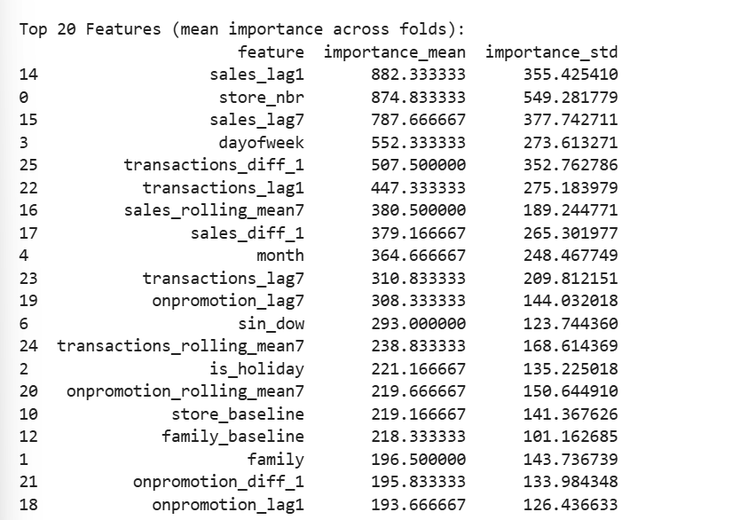
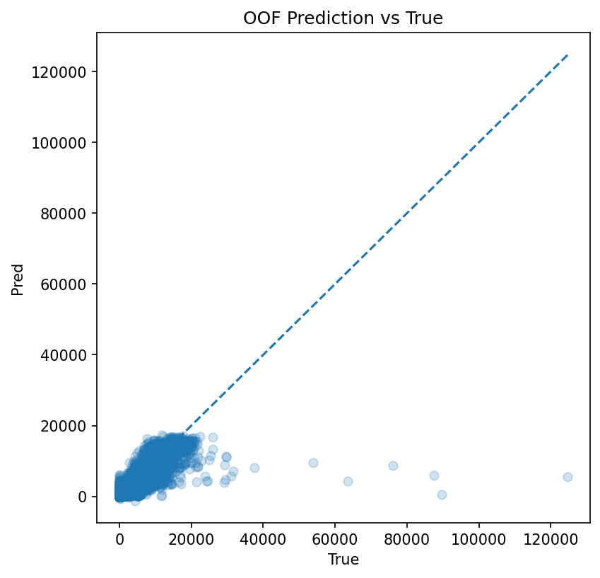
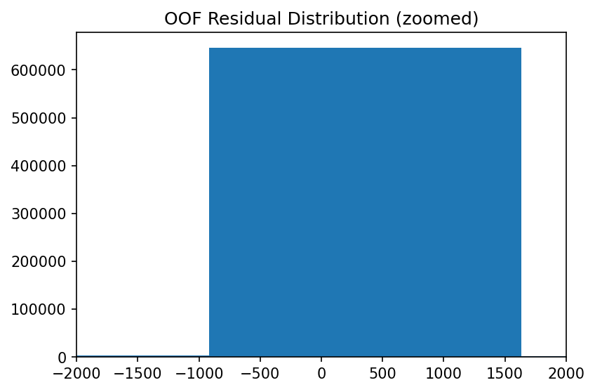
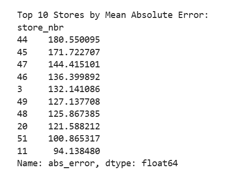
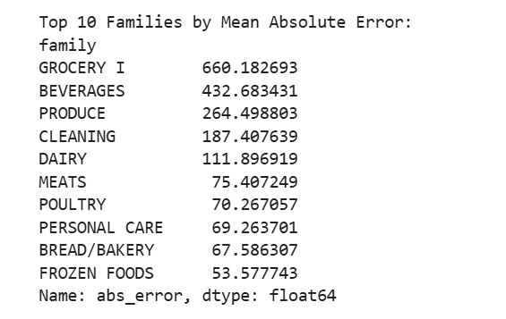
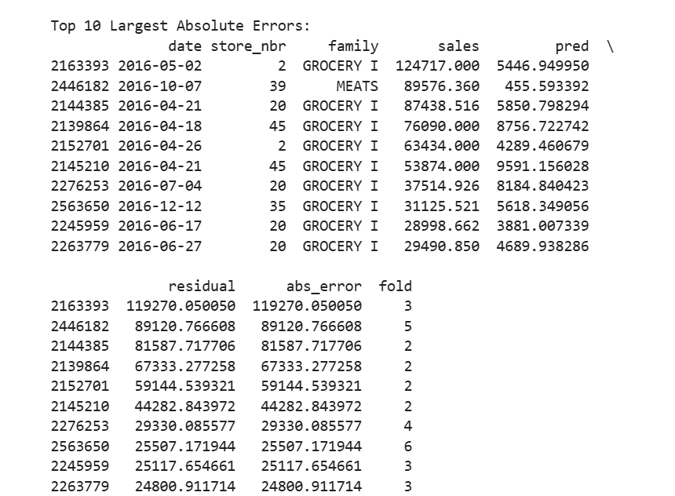

## Modeling

## 1.overview

### 1.1 Model Choice

Given the tabular nature of the dataset and the presence of complex nonlinear interactions between features (e.g., time, promotion, product category, and store effects), a tree-based gradient boosting model is adopted.

Specifically, **LightGBM** is used due to its:

- Strong performance on structured/tabular data
- Ability to handle heterogeneous features (numerical + categorical)
- Robustness to feature scaling and missing values
- Efficiency in training on large datasets

LightGBM is particularly suitable for this problem, as it can naturally capture:

- Nonlinear relationships
- Feature interactions (e.g., promotion × family, time × store)
- Piecewise patterns in demand dynamics

This makes it well aligned with the structural patterns identified during EDA and feature engineering.

### 1.2 Validation Strategy

To evaluate model performance under realistic forecasting conditions, a time-based cross-validation strategy is adopted.

An expanding window approach is used:

- Training data starts from 2013 and progressively expands
- Validation is performed on subsequent future periods
- Each fold simulates a real-world forecasting scenario

This ensures that:

- No future information is used during training
- The model is evaluated on truly unseen data
- Temporal dependencies are preserved

This setup is particularly important for time series problems, where random splits would lead to leakage.

### 1.3 Training Setup

The model is trained using LightGBM with the following configuration:

- Objective: regression
- Learning rate: 0.05
- Number of estimators: 500
- Number of leaves: 31

Early stopping is applied based on validation RMSE to prevent overfitting.

For each fold:

- The model is trained on historical data
- Predictions are generated on a forward validation window
- Results are stored for out-of-fold (OOF) evaluation

### 1.4 Evaluation Metrics

Model performance is evaluated using Root Mean Squared Error (RMSE).

Two levels of evaluation are used:

- **Fold-level RMSE**  
  Measures performance on each validation period

- **Out-of-Fold (OOF) RMSE**  
  Aggregates predictions across all folds, providing a more robust estimate of generalization performance

RMSE is chosen because it penalizes large errors more heavily, which is important in retail forecasting where demand spikes are critical.

## 2.Results

The model demonstrates consistent performance across folds, indicating stable generalization over time.

- Mean CV RMSE: 363.574
- OOF RMSE: 377.4702

The similarity between fold-level and OOF performance suggests that the model generalizes well across different temporal regimes.

### Feature Improtance

The oof resault of feature importance is as follows,

Based on the feature importance derived from the LightGBM model, the key drivers of sales prediction can be categorized into three hierarchical groups:

#### 1. Primary Drivers

- store_nbr  
- sales_lag1, sales_lag7  
- transactions_diff_1, transactions_lag1, transactions_lag7  

These features form the core predictive foundation of the model:

- **store_nbr** (encoded as categorical) captures structural differences across stores and acts as the most important segmentation dimension  
- **sales lag features** reflect strong temporal dependency, which is fundamental in time series forecasting  
- **transactions features** serve as a proxy for customer demand, directly influencing sales volume  

👉 This layer reveals the core modeling structure:

> Sales ≈ historical demand (inertia) + current demand (transactions) + store-specific effects

#### 2. Structural & Seasonal Factors

- dayofweek, month, sin_dow  
- sales_diff_1, sales_rolling_mean7  
- transactions_rolling_mean7  
- family  

These features act as structural adjustments to the base prediction:

- Time-based features (e.g., weekday, month) capture periodic patterns  
- Rolling and differencing features reflect short-term trend dynamics  
- **family (product category)** provides structural information about product composition and plays a moderately important role  

👉 Note:

> Product categories influence sales patterns, but are not the primary drivers of short-term fluctuations.

#### 3. Secondary / Perturbation Signals

- onpromotion_lag1, onpromotion_lag7  
- onpromotion_diff_1, onpromotion_rolling_mean7  
- is_holiday  
- store_baseline, family_baseline, family_ratio_hist  

These features contribute to the model but have relatively weaker overall impact:

- **promotion and holiday effects** influence sales but are not dominant drivers in this dataset  
- **baseline and ratio features** provide long-term structural signals, but are partially replaced by stronger lag and transaction features  

#### 4.Key Insights

- The model primarily relies on **temporal dependency (lag features)** and **demand signals (transactions)** for prediction  
- **store_nbr**, as a categorical feature, significantly improves model performance, indicating strong heterogeneity across stores  
- **family (product category)** has moderate importance, acting as a structural constraint rather than a short-term driver  
- **promotion and holiday effects** appear relatively weak in the current feature system, suggesting their impact may already be absorbed by other variables  
- Overall, the model follows a hybrid structure of:

> time-driven dynamics + structural adjustments

#### 5. Modeling Perspective

The model can be interpreted as an instance of **implicit hierarchical modeling**.

Store-level heterogeneity
        ↓
Product family structure
        ↓
Temporal dynamics (dominant)

In other words, the model first differentiates across stores, then captures variation within product category structures, and ultimately relies on temporal dynamics as the primary driver of prediction.

### Residual Analysis

*Figure: Out-of-fold (OOF) predictions vs true values*

The scatter plot shows a clear positive relationship between predicted and true values, confirming that the model captures the overall trend in the data.

However, a systematic underestimation is observed for high sales values. As true sales increase, predictions tend to saturate and deviate further from the diagonal line, indicating difficulty in modeling extreme demand spikes.

Additionally, prediction variance increases with higher sales levels, suggesting heteroscedasticity in the data.

These patterns indicate that while the model performs well in the normal sales range, it struggles to accurately capture rare high-demand events.

*Figure: Distribution of out-of-fold (OOF) residuals (zoomed around zero)*

To better visualize the central distribution, residuals are truncated to a range around zero. The full distribution contains a long right tail extending to much larger values (up to ~20,000), which would otherwise dominate the visualization.

Within the zoomed range, residuals appear skewed toward positive values, indicating a tendency for the model to **underestimate actual sales**.

This bias becomes more pronounced when considering the full distribution, where the right tail reflects large underprediction errors in extreme cases.

Overall, the model performs reasonably well for typical observations but struggles with high-sales events, leading to asymmetric error distribution.

This pattern is consistent with earlier findings that extreme sales are not fully explained by the current feature set.

### Model Error Analysis and Behavioral Insights

#### Overall Performance

The model performs well within the normal sales range, effectively capturing the variation patterns of the majority of observations.  

However, in extreme high-sales scenarios, it exhibits clear underestimation, reflecting the typical challenge of predicting long-tail distributions.

#### Long-tail Distribution Characteristics

Extreme sales observations are primarily concentrated in food-related categories, particularly **GROCERY I**, and appear across multiple stores.  

This indicates that the phenomenon is **not driven by individual stores**, but rather originates from **category-level demand fluctuations**.

While the model performs stably in the normal range, it lacks features capable of capturing **demand triggering mechanisms** (e.g., promotion intensity, pre-holiday stocking behavior).  

As a result, systematic underestimation occurs in high-sales scenarios.

#### Error Structure Decomposition

Model errors can be broadly categorized into two types:

##### 1. Long-tail Errors (Low frequency, high impact)

- Mainly concentrated in categories such as **GROCERY I** and **BEVERAGES**  
- Caused by sudden spikes in demand  
- Occur infrequently but contribute significantly to overall RMSE  

##### 2. Systematic Errors (High frequency, moderate impact)

- Observed in categories such as **PRODUCE** and **CLEANING**  
- Manifest as persistent prediction bias  
- Indicate insufficient modeling of these categories  

In addition, certain stores (e.g., **store 45, 44, 20**) consistently exhibit higher errors across multiple time windows, suggesting more complex or volatile sales patterns.

#### Log Transformation Attempt

A log transformation was applied to the target variable to mitigate the long-tail distribution.

Although the residual distribution became more symmetric after transformation, the RMSE increased when converted back to the original sales scale.  

Moreover, an overall upward bias in predictions was observed.

Therefore, the final model retains the **original sales values as the target**, ensuring consistency between evaluation metrics and business objectives.

#### Residual Seasonality Analysis

An attempt was made to analyze residual patterns across the day-of-week dimension.  

However, results were inconsistent across different rolling windows, and no stable periodic bias was identified.  

Thus, this analysis was not included in the final conclusions.

### Key Conclusions

- The model performs stably within the normal sales range but systematically underestimates extreme demand scenarios  
- Prediction errors arise from both **long-tail shocks** and **insufficient category-level modeling**  
- The model is primarily driven by temporal dynamics, with limited ability to capture demand-triggering mechanisms  
- Future improvements should focus more on **trigger-based feature engineering**, rather than simply increasing model complexity  

## Limitations & Future Work

### Limitations

- The model is unable to capture sudden demand spikes (e.g., pre-holiday stocking behavior)  
- Lack of explicit features representing promotion intensity  
- Long-tail distribution leads to underestimation in high-sales scenarios  

### Future Work

- Incorporate event-based and holiday-related features to better capture demand triggers  
- Introduce segmented modeling strategies (e.g., separate models for low vs. high sales regimes)  

These directions suggest that improving feature representation is likely more impactful than increasing model complexity.

